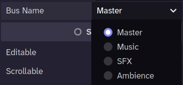
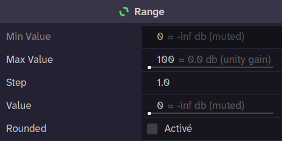
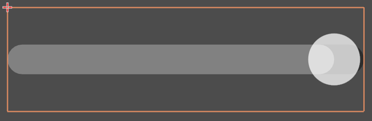
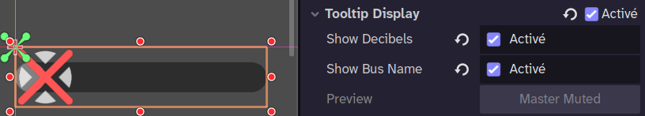
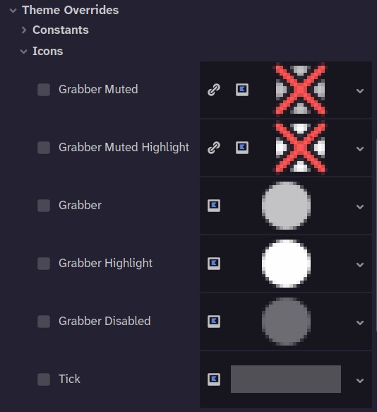
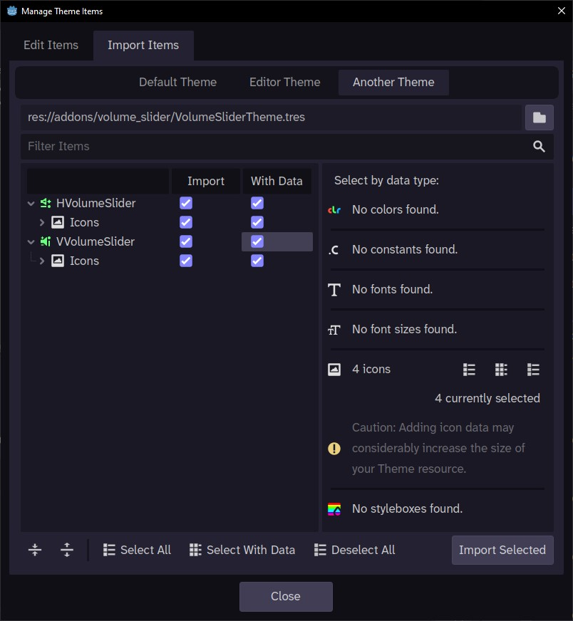

# Godot Volume Slider

A simple and ready-to-use volume slider plugin for Godot 4. It provides `HVolumeSlider` and `VVolumeSlider` nodes that directly control the volume of any audio bus, with mute buttons, labels, tooltips, and accessibility support built in — no scripting required.

## Features

- **Horizontal & Vertical Slider**:
  -  `HVolumeSlider`
  -  `VVolumeSlider`
- **Dynamic Bus Selection**: Select the audio bus from a dropdown list in the Inspector, automatically populated with your project's actual audio buses and kept in sync if buses are renamed or the layout changes.

  
- **Automatic dB Conversion**: Converts the slider's linear value (0-100 by default) to the logarithmic dB scale used by Godot's `AudioServer`. A value of 100 always corresponds to 0 dB (unity gain, no change), and a value of 0 corresponds to silence.

  
- **Optional Gain Boost**: `min_value` is locked to 0 (always corresponding to silence) and always shown read-only with its dB suffix, while `max_value` can optionally be raised up to 200 to allow boosting the bus volume above unity gain for players who want extra headroom.
- **Auto-Mute**: Automatically mutes the bus when the volume is set to its minimum value, with dedicated `muted`/`unmuted` signals and custom grabber icon overrides for the muted state.

  
- **One-Click Mute Button**: Generate a linked `CheckBox` mute button directly from the Inspector. It's automatically wrapped in a matching `VBoxContainer`/`HBoxContainer` when needed, preserves the original layout (anchors, offsets, size flags), and is fully undo/redo-friendly in the editor.

  
- **Label Display**: Generate or bind a `Label` to show the live volume percentage, with optional rounding and editor preview. Like the mute button, it's also automatically wrapped in a matching `VBoxContainer`/`HBoxContainer` when needed, preserves the original layout (anchors, offsets, size flags), and is fully undo/redo-friendly in the editor.

  
- **Dynamic Tooltip**: Built-in tooltip with configurable bus name/decibel display, plus auto-filled screen-reader accessibility name and description.

  
  
  
- **Volume Signals**: Emits `volume_changed(volume_db)` whenever the volume changes, `muted` when the slider triggers a bus to be muted (reaching the minimum value), and `unmuted` when the slider triggers a bus to be unmuted (sliding the slider to any non-minimum value).
- **Gain boost**: raise `max_value` above 100 (up to 200) to allow the slider to go past unity gain and amplify the bus volume.
- **Custom Theme Overrides**: The grabber icon can be customized by assigning a `Texture2D` to the `grabber_muted` and `grabber_unmuted` properties in the Theme Overrides or in your project's `Theme` resource. The plugin provides default icons for both the muted and unmuted states in the [Theme resource](addons/volume_slider/icons/volume_slider_theme.tres).

  
  You can also import the `grabber_muted` and `grabber_unmuted` icons theme properties for the classes `VVolumeSlider` and `HVolumeSlider` into your project's `Theme`.

  

## Installation

### From Godot Asset Store (Recommended)

1. Open the **Asset Store** tab in the Godot editor.
2. Search for "Volume Slider".
3. Click **Download**, and then **Install**.
4. Enable the plugin in **Project -> Project Settings -> Plugins**.

### Manual Installation

1. Download the latest `volume_slider.zip` from the [GitHub repository's releases page](https://github.com/Skar0ps/VolumeSlider/releases); this archive contains only the `addons` folder.
2. Extract the contents of the ZIP file into your project's root folder.
3. Enable the plugin in **Project -> Project Settings -> Plugins**.

## How to Use

1. After enabling the plugin, two new nodes are available: `HVolumeSlider` and `VVolumeSlider`.
2. Add one of these nodes to your scene.
3. In the Inspector, find the **Bus Name** property and select the desired audio bus (e.g., "Master", "Music", "SFX").
4. That's it! The slider now controls the volume of the selected bus at runtime.

## License

This plugin is released under the MIT License. See the [LICENSE](addons/volume_slider/LICENSE) file for more details.
